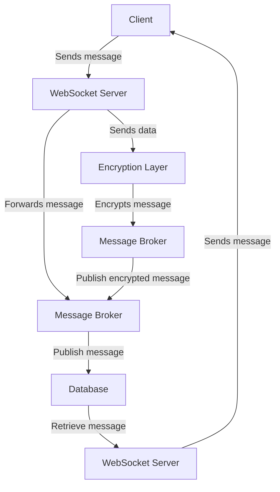

# SafeChat

## Project Overview
SafeChat is an instant messaging application that provides secure communication through advanced encryption techniques. This document outlines the system architecture and component interactions of the SafeChat application.

## System Architecture

## Component Interactions
- **Client**: The end user interface that sends and receives messages.
- **WebSocket Server**: Manages real-time communication, facilitating message exchange between clients.
- **Message Broker**: Kafka acts as the message broker for handling message routing.
- **Database**: Stores user data, messages, and other application data securely.
- **Encryption Layer**: Ensures that messages are encrypted and decrypted securely.

## Data Flow
1. Clients send messages to the WebSocket Server.
2. The server forwards these messages to the Kafka Message Broker.
3. The broker handles the message distribution to necessary components.
4. Messages are stored in the Database and retrieved when needed.

## Message Handling
- Messages are maintained in a queue until processed.
- Delivery acknowledgments are sent upon successful message delivery.

## WebSocket Communication
- Utilizes WebSockets for persistent, real-time communication.
- Provides low-latency message transmission.

## Kafka Message Broker Integration
- Kafka is used for managing messages effectively, providing durability and scalability for message processing.
- Integration simplifies message flow management and enhances performance.

## Database Operations
- Operations include creating, reading, updating, and deleting user and message data.
- Ensures data consistency and security via transactions.

## Encryption Flow
- Utilizes industry-standard encryption algorithms to ensure message security.
- Encryption occurs at the sender’s side before message transmission.

## Technical Documentation
- Detailed technical specifications of how each layer interacts are available upon request.

## Conclusion
The architecture of SafeChat facilitates secure and efficient communication. Ongoing developments will introduce more features and improve existing ones.

---
*Last Updated: 2026-04-04 05:20:02 UTC*